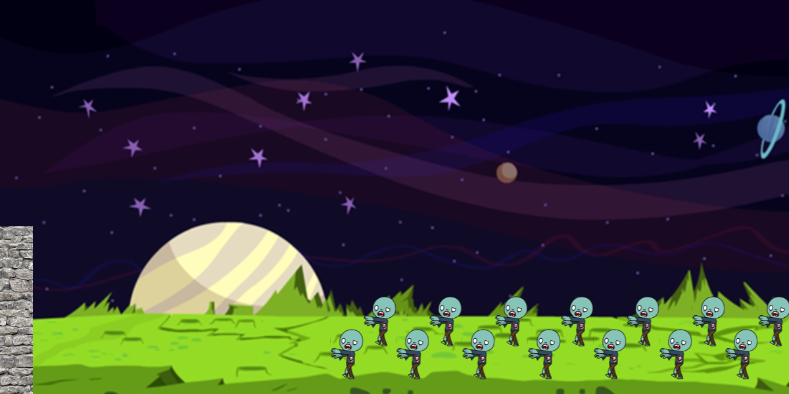

# Phaser.io Game Development for Students

## Unit 1: Zombie Animation

### Zombie Animation 

* 1 quả bóng ở giữa khung hình rơi từ trên xuống dưới và nảy lại vài lần cho đến khi dừng hẳn lại
* Các files html part0 đến part5 hướng dẫn lần lượt các bước tạo nên animation
1. part0.html: template rỗng 
2. part1: Tạo ảnh tĩnh, thêm nhạc nền
3. part2: Tạo zombie thủ công từng con một
4. part3: Dùng vòng lặp để tạo nhiều zombie
5. part4: Thêm animation zombie di chuyển 
6. part5: Dùng điều kiện để tùy biến vị trí zombie
7. part6:
8. part7:
* Recommendation: sử dụng brackets.io editor để có chức năng live preview mở web trên localhost vì cần có server để chạy file phaser 

### Vài khái niệm lập trình cơ bản
* For Loop: 
* Conditional Logic - If/else if/else: 

### Câu hỏi kiểm tra kiến thức
1. Chúng ta sẽ lập trình game bằng ngôn ngữ gì? Phần code sẽ được viết trong thẻ nào của 1 trang web?
2. Biến là gì? Hàm là gì? 
3. Một game của Phaser.io gồm những hàm chính nào? Chức năng của từng hàm?
4. Muốn có hiệu ứng, tính năng vật lý trong game cần gì?
5. Gravity và bounce có tác dụng gì? Thay đổi giá trị của chúng, thay đổi gì xảy ra?

### English Keywords:
* 
* 
* 
* 

### Bài Tập: 
* Tuỳ biến fuzzy ball animation: thêm hình ảnh, thay đổi audio, thay đổi tốc độ rơi, nảy của vật
* Có thể sử dụng 1 số hình ảnh có sẵn hoặc tìm ngoài, khuyến khích các bạn thay đổi animation theo sáng tạo của bản thân